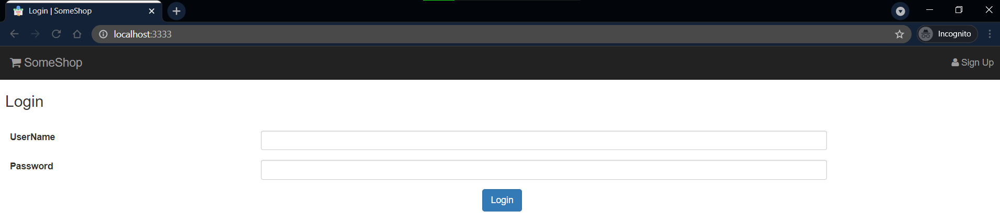
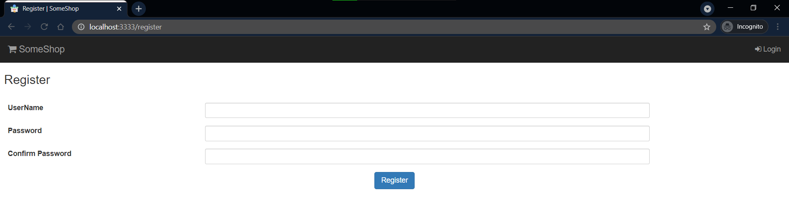
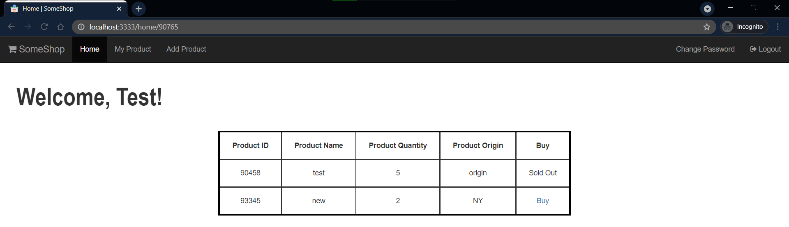
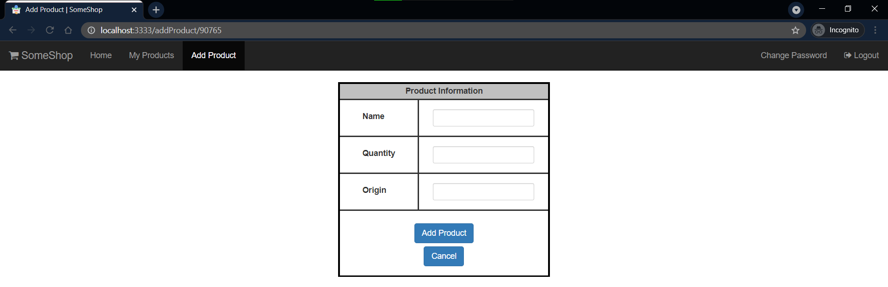

# Sample as a Microservice (SAAmS!)
*Basic eShop-based project using Microservices.*

★★★ Like this project? Leave a star, <a href="https://twitter.com/oijoshi">follow on Twitter</a>, or find me on <a href="https://www.linkedin.com/in/yashjosh/">LinkedIn</a>. Thanks! ★★★
 

This project facilitates: 
- creating users and products
- adding new user-owned products
- adding new products for sale
- buying products existing in the database
- other very basic `CRUD` operations
- basic UI using JSP

> This project covers basic concepts of implementing microservice architecture and uses concepts like spring cloud, feign client, netflix server and client, ribbon, gateway, etc. This project is created using Spring boot, JSP, and Java for the most part. It also includes core features of Spring Boot and usages of Spring Data JPA with demonstations of MVC architecture and some clean coding styles.

At an outset this project contains the following:
- Netflix eureka server
- Discovery clients
- API Gateway
- DB interaction services
- Client services to get data from DB services
- JSP pages for UI

Requirements to set-up and run the project:
- STS
- JDK
- MySQL
- Maven
- Any external browser and postman preferable for better testing

** **I have also included file to import postman collection (collection v2.1) which contains all sample requests for DB service to test the APIs and play around. Swagger isn't enabled but can be used as well, just add the dependancy!**

## Sample screens for the UI:

  
  
  
  
  
  

## Sample registered services in server dashboard:

  

 

#### This project is only for learning purpose. I don't own any resources like images use in the development of this project, and have used only for learning purposes. Whole code is written by me and solely belongs to me. This project is kept open-source to spread the knowledge and further support learning for other early professionals and students. I shall not be responsible in case of commercial redistribution, mishandling, misuse of data or any resource which belongs to this project. I have used Java 11 while development of this project which is limited to learning and development purposes. I have also used the following image as icon. The image is freely available online and I don't own the image. To credit the author for the image, the image can be accessed [here](https://www.flaticon.com/free-icon/online-shop_4689690).

 

You should [follow me on Twitter](https://twitter.com/oijoshi). Thanks for reading!
